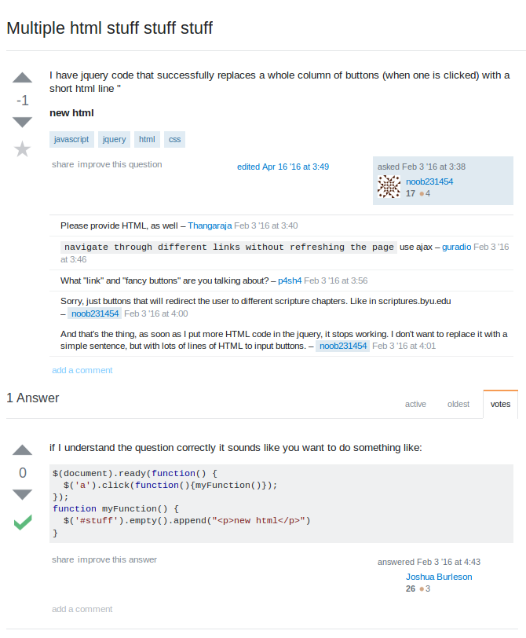

The goal of this essay is to is to look at the difference between what are considered "smart" questions and what are considered "not smart" questions in regards to asking for technical help on the web.  To figure this out, we will look at two specific questions pulled off of the Stack Overflow website. First will be example of the "smart" question and second the example of the "not smart" question. 

Earlier this semester, one of my professors told me that I should look into using LaTeX when I am creating math or algorithm related document. Usually I use Vim when I am writing. Since I heard that Vim happens to have a nice "LaTeX Suite", I decided to look into it on Stack Overflow and this question popped out at me as an example of a well written question. 

For this assignment, we were to read the writing by Eric Steven Raymond, called <a href="http://www.catb.org/esr/faqs/smart-questions.html">How To Ask Questions The Smart Way</a>. Besides general common sense, this writing provided a lot of the basis of what constitutes a good or bad question. Starting from the top, the title of the question is short, to the point and easy to understand. It implies that the querier wants to use Vim, LaTeX and a Makefile at the same time, but it is not working. This title is simple enough to get the readers attention, informative enough for the reader to decide if he or she might have enough incite to answer the question and smart enough to make the reader think that the querier at least looked into the question on his own before posting it. 

The second part of the question is where the querier gets the chance to elaborate a bit. The first two sentences show the reader that the querier actually knows how to use Vim to call the make utility, and that he also probably knows how to use the make utility itself. Secondly it shows exactly when the problem is happening, (only after switching to the LaTeX Suite) and that Vim :make works before hand. Then he explains exactly what Vim is doing afterwards, and proves that, in the words of Eric Steven Raymond, he actually RTFM by explaining what settings need to be used according to the documentation and that they are set properly. Next he clarifies the question that he is asking and lastly he provides which version of the LaTeX Suite was used and where it came from. 

  

  Link to the question: <a href="http://stackoverflow.com/questions/22318527/how-to-use-vim-latexsuite-with-a-makefile">Stack Overflow</a>

Other than the question itself being good, this example shows how a well written question often gets a precise answer and what should be done if a good answer is received. The answer not only gives two alternate ways to fix the problem, but also gives the location of where this information can be found and read for further in depth understanding of the problem. After the querier tried out the proposed solution, instead of seeing that his problem was fixed and going on his merry way, he actually takes the time to go back to the post and report that the solution worked. This does two things. One, it shows gratitude towards the person who answered the question, which makes it more likely that the person who answered will take time out of their life to provide free advice to the community again later. Two, it lets other people who have the same problem know that the solution worked, which makes it more likely that the question will not needlessly posted again, having the original, correctly answered post slowly fall into obscurity. 

Next is an example of a question that is not written very well.

  

