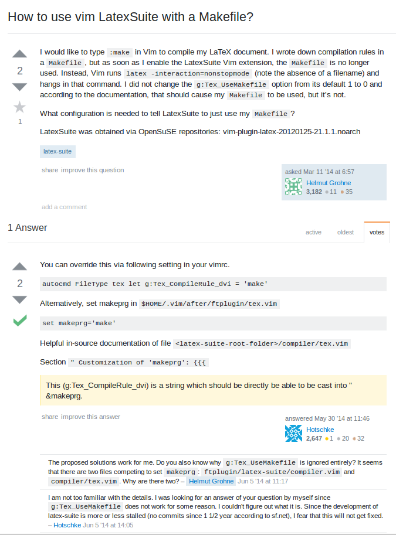

The goal of this essay is to is to look at the difference between what are considered "smart" questions and what are considered "not smart" questions in regards to asking for technical help on the web.  To figure this out, we will look at two specific questions pulled off of the Stack Overflow website. First will be example of the "smart" question and second the example of the "not smart" question. 

  
