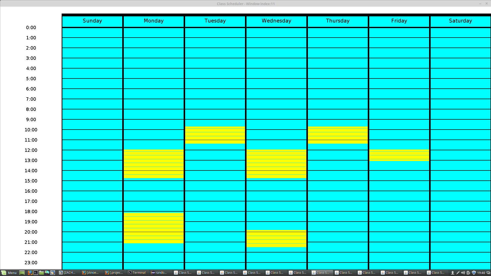

Before the 2017 spring semester at UH Manoa, there was no tool to help the students figure out their class schedules. Between my first and second semesters of java, I developed this program to output all of the possibilites and combonations of classes so I could help myself decide which classes to take at which times.
 
Source: <a href="https://github.com/zknoebel/ClassScheduler"><i class="large github icon"></i>zknoebel/ClassScheduler</a>
